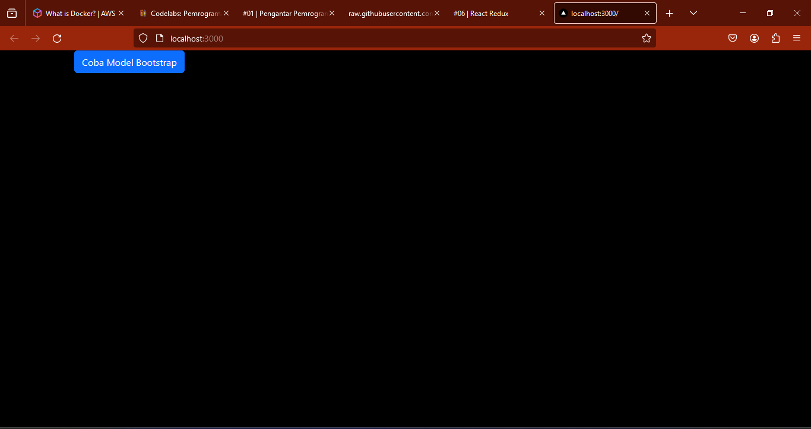
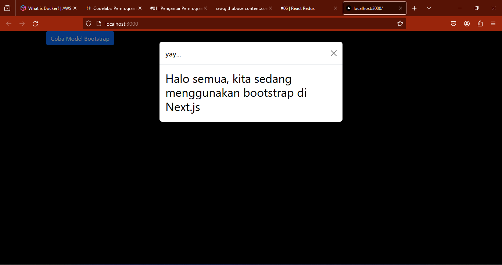

## Laporan Praktikum

|  | Pemrograman Berbasis Framework 2024 |
|--|--|
| NIM |  2141720153|
| Nama |  Muhammad Fahmi Huwaidi |
| Kelas | TI - 3I |

### Jawaban Soal 1

Bukti setup environment telah berhasil di  komputer.

### Jawaban Soal 2

Bukti setup environment telah berhasil di  komputer.

### Jawaban Soal 2

Bukti setup environment telah berhasil di  komputer.

### Jawaban Soal Practical Questions
Assignments (Practical Questions)

1. Importing useEffect within page/_app.tsx enables the provision of global configurations, cleanups, or side effects applicable across your entire Next.js application. This integration serves as an efficient means to centrally manage the functionality of the entire application by importing { useEffect } from "react" from the React library. The useEffect hook handles functional component side effects such as data fetching, external event subscriptions, and manual DOM interactions.

2. Removing instructions akin to the one mentioned above, in my view, won't affect the useEffect structure. The referenced line primarily pertains to a Bootstrap command, which doesn't intersect with the useEffect process. Nevertheless, it may be articulated as such. The failure observed is attributed to the Bootstrap usage this time.

3. To avert issues with the JavaScript class keyword and to accommodate JSX-compatible HTML tags, React and Next.js utilize className instead of class. Moreover, className functions as a directive to designate the CSS class within the specified className, like div className = container.

4. Based on experimental observation, it's plausible to incorporate numerous Redux reducers into the store. Next.js can integrate Redux to manage the application's state, encompassing various reducers. Redux facilitates the construction of a singular store governing state managed by multiple reducers.

5. Typically, in a Redux setup, the store.js file serves as the principal configuration file for establishing and configuring the Redux store. While adhering to a conventional naming convention, you possess the liberty to rename this file as desired. This facilitates Next.js developers in employing Redux configurations as a centralized setup.

6. Within the page/login.tsx file, the code const { isLogin } = useSelector((state) => state.auth); utilizes the React Redux useSelector hook to extract the isLogin property from the authentication segment of the Redux store. This code snippet operates as follows:

   - useSelector: A React Redux hook utilized to retrieve information from the Redux state. It returns selected data from the Redux state following the provision of a selector function.
   - (state) · state.auth: The selector function accepted by useSelector returns the authentication state chunk after receiving the entire Redux state as input.
   - { isLogin }: This snippet extracts the isLogin property from the Redux state's authentication slice through object destructuring, assigning it to the isLogin variable.

7. The line const { totalCounter } = useSelector((state) => state.counter); within the page/counter.tsx file retrieves the totalCounter property from the Redux store's counter state by leveraging the useSelector hook from React Redux. The functions of each component in this code snippet are as follows:

   - useSelector: A React Redux hook employed to fetch data from the Redux state. It returns selected data from the Redux state after receiving a selector function as input.
   - (state) · state.counter: The selector function accepted by useSelector retrieves the counter state chunk after receiving the entire Redux state as an argument.
   - { totalCounter }: This segment extracts the totalCounter property from the Redux state's counter slice via object destructuring, assigning its value to the totalCounter variable.
